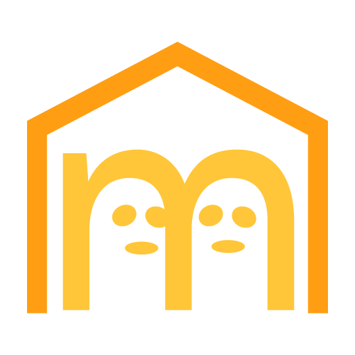
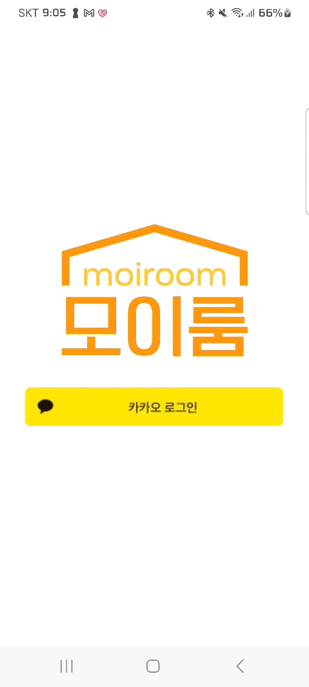
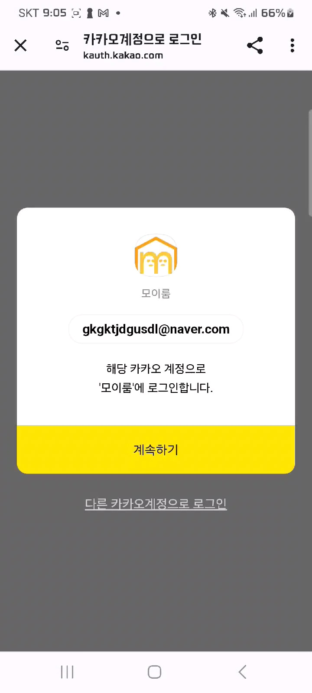
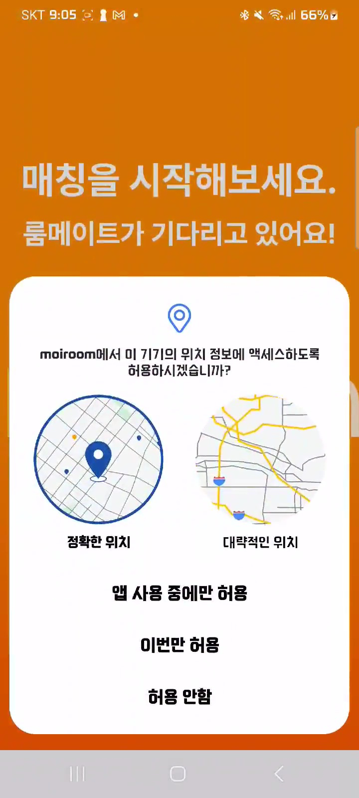
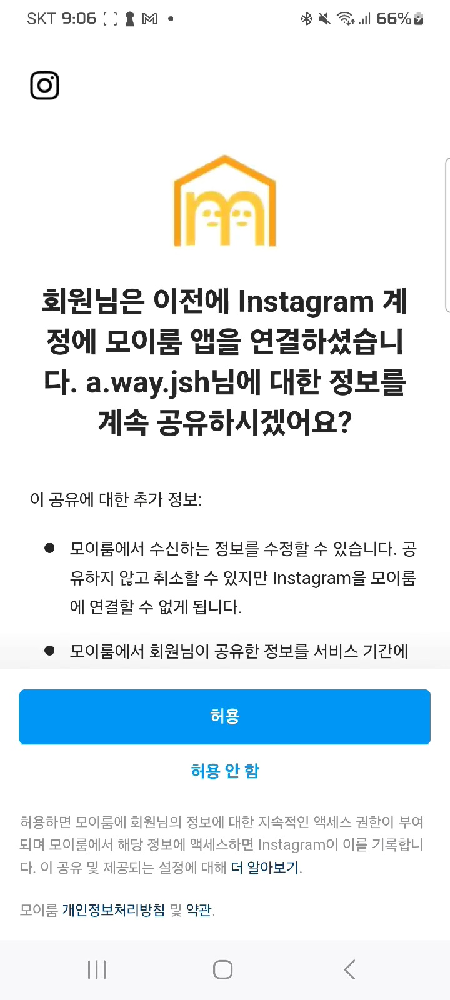
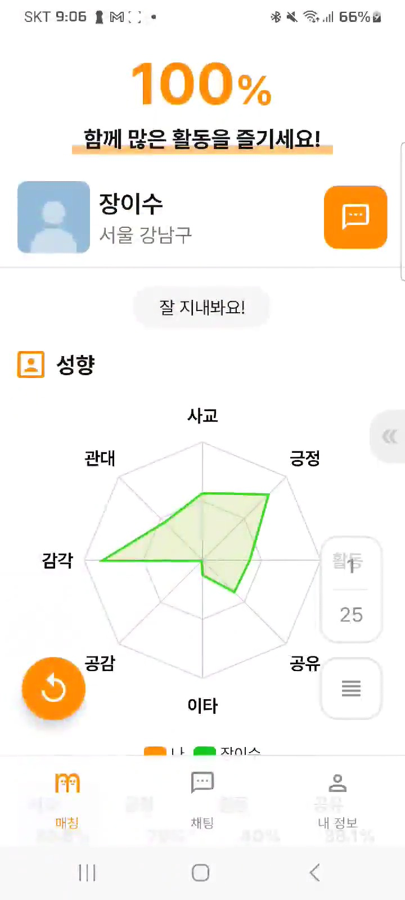
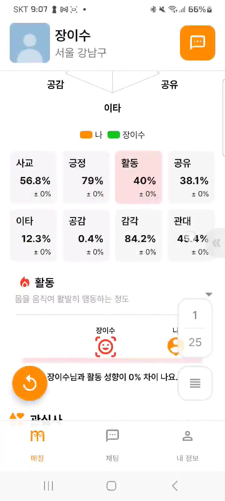
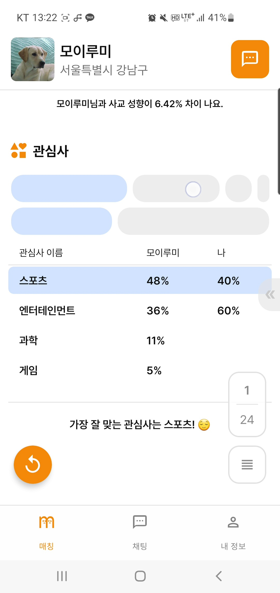
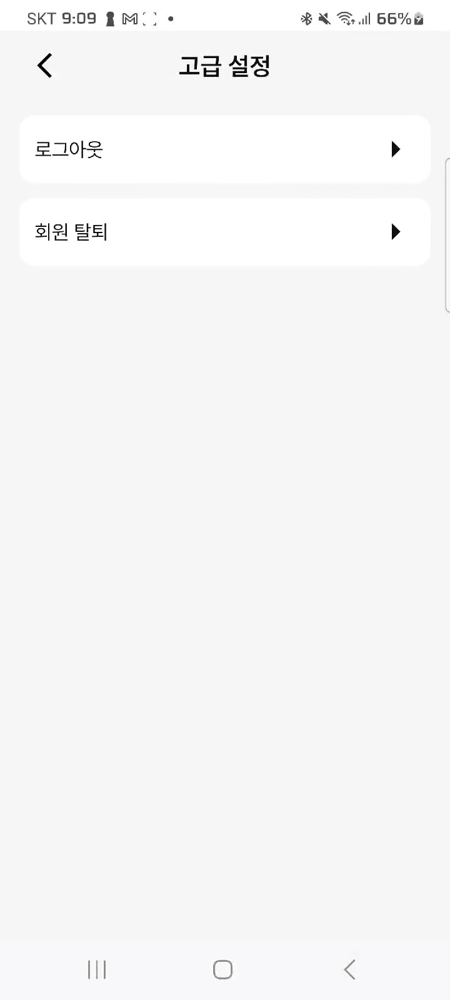

# :house: 룸메이트 추천 서비스 moiroom :house_with_garden:



```
📢 SSFAY 10기 2학기 공통프로젝트
📢 서울 4반
📢 23.1.2 ~ 23.2.16 (총 7주)
```
<br/>

---

# 🔍1. moiroom 소개

### **💰나와 잘 맞는 룸메이트를 찾는 이용자를 위한 서비스**

    사용자의 휴대폰 사용 기록을 분석해 성향을 분석하고, 분석한 성향을 바탕으로 룸메이트를 추천해주는 서비스

<br/>

# 🔍2. 개발 환경

## 2-1. 환경설정

### :computer: **Frontend**
<div style="display: flex; flex-direction: row;">
    
    
    
    
    
    
</div>

### :cd: **Backend**
<div style="display: flex; flex-direction: row;">
    
    
    
    
    
    
    
</div>


### 🤝 **Collaboration Tools**
<div style="display: flex; flex-direction: row;">
    
    
</div>

<br/>

# 🔍3. 주요 기능

### - 소셜 로그인
<div style="display: flex; flex-direction: row;">
  
  
</div>

### - 기본 정보 및 자기 소개 등록
  

### - 사용자 권한 허용
<div style="display: flex; flex-direction: row;">
  
  
  
  
  
  
</div>

### - 성향 분석 및 룸메이트 추천
<div style="display: flex; flex-direction: row;">
  
  
  
</div>

### - 채팅
<div style="display: flex; flex-direction: row;">
  
  
</div>

### - 정보 수정 및 기타 기능
<div style="display: flex; flex-direction: row;">
  
  
</div>

<br/>
<br/>

# 🔍4. 산출물
## 4-1. ERD

## 4-2. Notion
https://www.notion.so/adf1b62e73d8420597e365f919add4a1

<br/>

# 👩‍👦‍👦5. 팀 소개

|                   Frontend                    |                   Frontend                    |                   Frontend                    |                   Backend                    |                   Backend                    |                   Backend                    |
| :------------------------------------------: | :------------------------------------------: | :------------------------------------------: | :------------------------------------------: | :------------------------------------------: | :------------------------------------------: |
|  |  |  |  |  |  |
|                    김준수                    |                    정성현                    |                    황재언                    |                    김예지                    |                    전새벽                    |                    진주성                    |